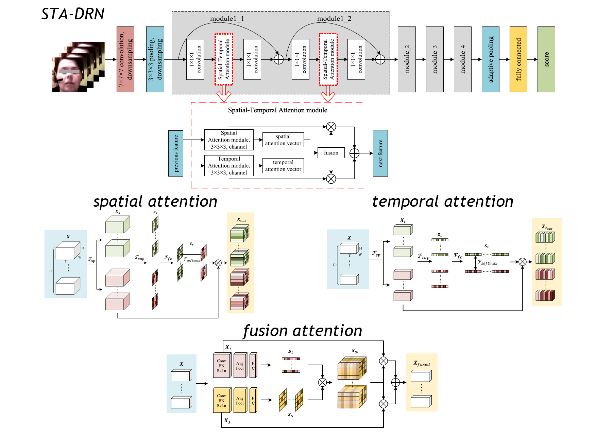

# STA-DRN

**(Update) The network weight and efficient validation/test script are now available.**

Code for the paper 'Spatial-Temporal Attention Network for Depression Recognition from Facial Videos' (doi: https://doi.org/10.1016/j.eswa.2023.121410)



## Pre-process

**(Recommend) Using [OpenFace](https://github.com/TadasBaltrusaitis/OpenFace) to crop the facial frames. **

[face_detect.py](https://github.com/divertingPan/utility_room/blob/master/face_detect.py): Crop faces from a series of video frame images. The images should be frames already exported from the video. To run the program directly, the path format for storing images should be `dataset_path/video_001/00001.jpg、dataset_path/video_001/00002.jpg`, and another model file [shape_predictor_68_face_landmarks.dat](https://github.com/divertingPan/utility_room/blob/master/shape_predictor_68_face_landmarks.dat) is also required.

## How to Run
You can directly execute the `train_update.py` or `test_update.py` scripts with your own dataset.

To proceed:
1. Create a CSV file containing the `path`, which is the folder containing the images extracted from each video, and the corresponding `label`, representing the ground truth of that video.
2. Make sure to modify line 71 in `train_update.py` and line 35, 87 in `test_update.py` to suit your dataset.

## Notes
Before running, ensure the videos are preprocessed to extract the required images.

Kindly note that due to authorization constraints, we are unable to share the AVEC datasets here. Therefore, it is necessary for you to independently extract, crop, and align the facial data. **We have NO authorization to share any raw AVEC dataset. The issue of asking for sharing datasets will be closed.**

It's worth highlighting that this model can be applied to various video-based tasks. We encourage you to give it a try!

## Citation
```
@article{PAN2023121410,
title = {Spatial-Temporal Attention Network for Depression Recognition from facial videos},
journal = {Expert Systems with Applications},
pages = {121410},
year = {2023},
issn = {0957-4174},
doi = {https://doi.org/10.1016/j.eswa.2023.121410},
url = {https://www.sciencedirect.com/science/article/pii/S0957417423019127},
author = {Yuchen Pan and Yuanyuan Shang and Tie Liu and Zhuhong Shao and Guodong Guo and Hui Ding and Qiang Hu}
}
```
